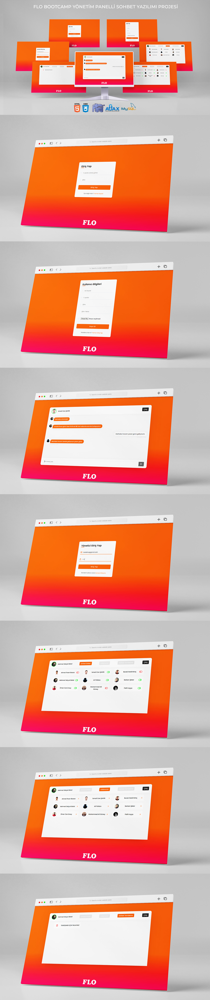

# FLO BOOTCAMP BİTİRME PROJESİ

### Proje

PHP ve AJAX ile yönetim panelli sohbet yazılımı

### Proje Sunum

### Proje Video

### Proje Anlatım

1. Öncelikle kayıt işlemleri için singup.php dosyası oluşturuldu. 

    - Kullanıcıdan form içerisinde alınan veriler bazı kontrollere tabi tutularak POST metodu içerisine alındı.

    
    
    - Gerekli güvenlik fonksiyonlarından geçirilerek veri tabanına kayıt edilerek hesap oluşturuldu.

    

2. Giriş işlemleri için login.php dosyası oluşturuldu. 

    - Kullanıcıdan alınan giriş bilgilerinin veri tabanından eşleştirmesi yapıldı. Eğer eşleşme varsa chat.php sayfasına yönlendirme yapıldı.

    

3. Tüm sayfalarda kullanıcı bilgisi SESSION dosyasına atılarak kontrol yapıldı.

4. Gerekli tüm veriler veritabanı ile bağlantı kurularak chat.php sayfasında HTML ve CSS ile tasarımda kullanıldı.
    - Ajax ile sayfa yenilenmeden mesajların message.php sayfasından gönderilmesi sağlandı.

    
    

    - Ajax ile realTime.php sayfasından sohbet ekranının belirli aralıklarla yenilenmesi sağlandı.

    

5. Çıkış işlemleri için cikis.php sayfasında gerekli kodlar yazıldı.

6. Yönetici Giriş işlemleri için yonetici.php dosyası oluşturuldu. 

    - Kullanıcıdan alınan giriş bilgilerinin veri tabanından eşleştirmesi yapıldı. Eğer eşleşme varsa yonetici_index.php sayfasına yönlendirme yapıldı.

    

7. Gerekli tüm veriler veritabanı ile bağlantı kurularak yonetici_index.php sayfasında HTML ve CSS ile tasarımda kullanıldı.

    - Kullanıcıların sohbet içerisinde yazmalarını kapatıp açmamızı sağlana algoritma yazıldı.
    Veri tabanında durum sutununda değer 1 ise yazmaya izin var 0 ise yazması engelli olarak ayarlandı.

    

    - Konulan butonlar ile izin durumlarının kontrol edilebilmesi işlemi activedeactive.php sayfasında ayarlandı.

    
    
8. Kullanıcılar kısmından yöneticinin üyeleri silebilmesi için gerekli kodlar yazıldı.

    

    - Gerekli bilgiler GET metodu ile sil.php sayfasına gönderilerek veri tabanından kullanıcı silindi.

    

9.  Sohbet Temizleme kısmından yöneticinin tüm sohbet geçmişini silebilmesi için gerekli kodlar yazıldı.

    

    - Gerekli bilgiler GET metodu ile clear.php sayfasına gönderilerek veri tabanından sohbet silindi silindi.
 
    

Giriş Ekranı Gerekli Link http://localhost/sohbetyazilimi/login.php
Mail: batalms@gmail.com
Şifre: 1234

Yönetici Giriş Ekranı İçin Gerekli Link http://localhost/sohbetyazilimi/yonetici.php
Mail: batalms@gmail.com
Şifre: 1234

<!--  -->