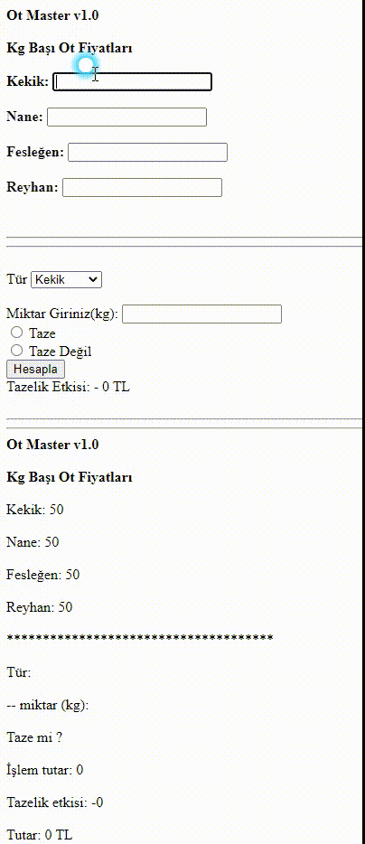

# 3. Hafta Ödevi

## Yapılanlar
Bir aktar farklı otlar satmaktadır. Müşteriler dükkâna gelip bu otlardan değişen oranlarda istediği 
kadar alabilmektedir. Dükkân sahibinin her bir müşterisi için 
fatura hesabı yapacak bir programa ihtiyacı vardır. Otların 
isimleri ve ilgili kodları yandaki tabloda verilmiştir. Otların 
fiyatları ise günlük olarak değişmektedir ve tazeliklerine göre 
belirlenmektedir. Her bir ot türü tazeliğini kaybettiğinde 
farklı oranlarda fiyat kaybına uğramaktadır. Bu kayıp oranı 
yine yandaki tabloda verilmiştir. Buna göre sırasıyla aşağıdaki 
işlemleri yapan bir programını yazınız.

1) O günün ot birim fiyatları (1 kg için) 
girilecek
2) Müşteri satin alacağı ot adını girecek.
3) Müşterinin aldığı ot için;
a. tür, miktar (gr) ve taze olup 
olmadığını (1’ ise taze 0 site 
değil) bilgileri alınacak
b. satış tutarı hesaplanıp 
ekrana yazdırılacak
4) Toplam tutar, KDV gibi bilgilerle fotura 
ekrana basılacak.

##Yapılacak ve kullanılacak fonksiyonlarsa 
şöyledir:
Ot fiyatının hesaplamaya girmesi için aldığı ot 
ismine göre birim fiyat döndüren bir 
otBirimFiyat isimli bir fonksiyon yapınız.
Aldığı ot ismi, tazelik durumu ve toplam fiyat 
bilgisine göre yapılacak düşüşü (tazelik etkisi) 
hesaplayacak tazelikEtkisi isimli bir fonksiyon 
yapınız.

## Görünüm

