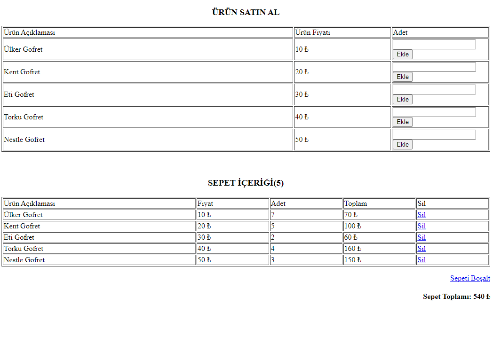

# 2. Hafta Ödevi

Bir dizi değişken içerisinde tanımlanan Ürün Adı ve Ürün Fiyatı değerlerini bir tablo halinde satırlar 
içerisinde yazdır ve her ürün için bir "Adet" kutusu (html form, input) ekle. Tablonun sonuna "Sepete 
Ekle" düğmesi (html form, submit) yerleştir. Sepete Ekle düğmesine tıklandığında adeti 0'dan yüksek 
olan ürünü sepet içeriğine ekle. Sepeti oturum dosyası (session) olarak saklamayı unutma ve her ürün 
sepete eklendikçe aynı sayfada bir de sepet içeriği listele.

## Yapılanlar
- Dizi değişken içerisinde ürünler ve fiyatları tanımlandı.
- Ürün adı, fiyatları ve adetleri tablo halinde eklendi.
- index.php dosyasında inputlar ile alınan veriler GET ve POST metodları ile islem.php dosyasında işlendi.
- Gerekli kontrolü sağlayan ürünler sepete eklendi.
- Sepet detayı ve toplam miktar tablo halinde bastırıldı.

## Görünüm

