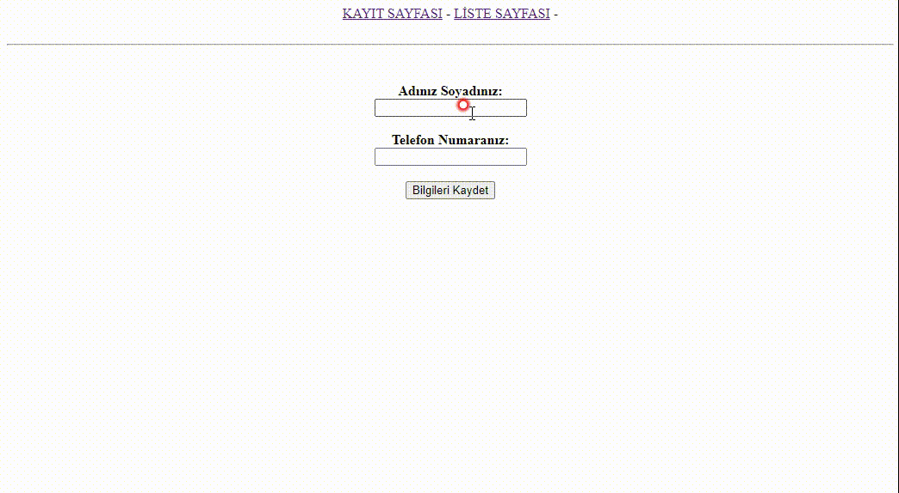

# 3. Hafta Ödevi

## Yapılanlar
- PhpMyAdmin kullanarak Ad Soyad ve Telefon Numarasının kaydedilebileceği bir MySQL tablosu 
- Bir dosyada bu bilgileri dinamik olarak ziyaretçilerin kaydedebilmesi için HTML formu hazırlandı
- İkinci bir dosyada bu formdan gelen verileri PHP'nin PDO kütüphanesini kullanarak MySQL veritabanına 
kaydedildi.
- Üçüncü bir dosyada veritabanında kayıtlı olan kişi bilgilerini bir HTML tablosu içerisinde listelendi.
- Her kayıtın sonuna "Sil" düğmesi ekle ve bu düğmeye tıklandığında ilgili kayıtın silinerek tekrar liste 
sayfasına dönülmesini sağla.

## Görünüm

